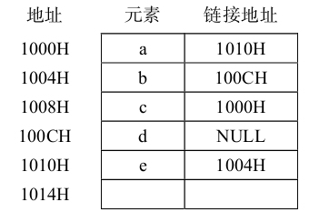

1．选择题  
（1）顺序表中第一个元素的存储地址是100，每个元素的长度为2，则第5个元素的地址是( B )  
&emsp;A. 110  
&emsp;B. 108  
&emsp;C. 100  
&emsp;D. 120  
（2）在含n个结点的顺序表中，算法的时间复杂度是O(1)的操作是( A )  
&emsp;A. 访问第i个结点（1≤i≤n）和求第i个结点的直接前驱（2≤i≤n）  
&emsp;B. 在第i个结点后插入一个新结点（1≤i≤n）  
&emsp;C. 删除第i个结点（1≤i≤n）  
&emsp;D. 将n个结点从小到大排序  
（3）在一个有127个元素的顺序表中插入一个新元素并保持原来顺序不变，平均要移动的元素个数为( B )  
&emsp;A. 8  
&emsp;B. 63.5  
&emsp;C. 63   
&emsp;D. 7  
（4）链接存储的存储结构所占存储空间( A )  
&emsp;A. 分为两部分，一部分存放结点值，另一部分存放表示结点间关系的指针  
&emsp;B. 只有一部分，存放结点值  
&emsp;C. 只有一部分，存储表示结点间关系的指针  
&emsp;D. 分两部分，一部分存放结点值，另一部分存放结点所占单元数  
（5）线性表若采用链式存储结构，要求内存中可用存储单元的地址( D )  
&emsp;A. 必须是连续的  
&emsp;B. 部分地址必须是连续的   
&emsp;C. 一定是不连续的  
&emsp;D. 连续或不连续都可以  
（6）线性表L在( B )情况下适用于使用链式结构实现。  
&emsp;A. 需经常修改L中的结点值  
&emsp;B. 需不断对L进行删除、插入  
&emsp;C. L中含有大量的结点  
&emsp;D. L中结点结构复杂  
（7）单链表的存储密度( C )  
&emsp;A. 大于1  
&emsp;B. 等于1  
&emsp;C. 小于1  
&emsp;D. 不能确定  
（8）将两个各有n个元素的有序表归并成一个有序表，其最少的比较次数是( A )  
&emsp;A. n  
&emsp;B. 2n−1  
&emsp;C. 2n  
&emsp;D. n−1  
（9）在一个长度为n的顺序表中，在第i个元素（1≤i≤n+1）之前插入一个新元素时需向后移动( B )个元素。  
&emsp;A. n−i  
&emsp;B. n−i+1   
&emsp;C. n−i−1  
&emsp;D. i  
（10）线性表L=(a1，a2,…，an)，下列陈述正确的是( D )  
&emsp;A. 每个元素都有一个直接前驱和一个直接后继   
&emsp;B. 线性表中至少有一个元素   
&emsp;C. 表中诸元素的排列必须是由小到大或由大到小   
&emsp;D. 除第一个和最后一个元素外，其余每个元素都有一个且仅有一个直接前驱和直接后继  
（11）创建一个包括n个结点的有序单链表的时间复杂度是( C )  
> 创建单链表的时间复杂度是O(n)，而要创建有序的单链表，则每生成一个新结点都要与已有的结点进行比较，确定恰当的插入位置，因此时间复杂度是O(n2)。
> 不是合并！！！

&emsp;A. O(1)  
&emsp;B. O(n)  
&emsp;C. O(n2)  
&emsp;D. O(nlog2n)  
（12）以下陈述错误的是( D )  
&emsp;A. 求表长、定位这两种运算在采用顺序存储结构时实现的效率不比采用链式存储结构时实现的效率低  
&emsp;B. 顺序存储的线性表可以随机存取  
&emsp;C. 由于顺序存储要求连续的存储区域，所以在存储管理上不够灵活  
&emsp;D. 线性表的链式存储结构优于顺序存储结构  
（13）在单链表中，要将s所指结点插入到p所指结点之后，其语句应为( D )  
&emsp;A. s->next=p+1; p->next=s;  
&emsp;B. (*p).next=s; (*s).next=(*p).next;  
&emsp;C. s->next=p->next; p->next=s->next;  
&emsp;D. s->next=p->next; p->next=s;  
（14）在双向链表存储结构中，删除p所指结点时修改指针的操作为( A )  
&emsp;A. p->next->prior=p->prior; p->prior->next=p->next;  
&emsp;B. p->next=p->next->next; p->next->prior=p;  
&emsp;C. p->prior->next=p; p->prior=p->prior->prior;  
&emsp;D. p->prior=p->next->next; p->next=p->prior->prior;  
（15）在双向循环链表中，在p指针所指的结点后插入q所指向的新结点，其修改指针的操作是( C )   
&emsp;A. p->next=q; q->prior=p; p->next->prior=q; q->next=q;  
&emsp;B. p->next=q; p->next->prior=q; q->prior=p; q->next=p->next;  
&emsp;C. q->prior=p; q->next=p->next; p->next->prior=q; p->next=q;  
&emsp;D. q->prior=p; q->next=p->next; p->next=q; p->next->prior=q;  
16.【2013年第1题】已知两个长度分别为m和n的升序链表，若将它们合并为一个长度为m+n的降序链表，则最坏情况下的时间复杂度是( <em>D</em> )  
> 正常来说，正序链表合并为逆序链表，时间复杂度为O(m+n)  
> 但是并没有提供该答案
> 因此分情况考虑
> 如果m与n接近，则时间复杂度趋近于O(n)，而O(n^2)远大于O(n)，所以排除
> 如果m远大于n，则时间复杂度趋近于O(m)，O(min(m,n))趋近于O(n)，所以排除
> 所以选择D

&emsp;A．O(n)  
&emsp;B．O(m×n)  
&emsp;C．O(min(m,n))  
&emsp;D．O(max(m,n))  
17.【2016年第1题】已知表头元素为c的单链表在内存中的存储状态如图2.1所示。现将f存放于1014H处并插入到单链表中，若f在逻辑上位于a和e之间，则a，e，f的“链接地址”依次是( D )  
> 注意审题，要求的是a,e,f的顺序，而不是a,f,e

&emsp;  
&emsp;A．1010H，1014H，1004H  
&emsp;B．1010H，1004H，1014H  
&emsp;C．1014H，1010H，1004H  
&emsp;D．1014H，1004H，1010H  
18.【2016年第2题】已知一个带有表头结点的双向循环链表L，结点结构为prev data next，其中，prev和next分别是指向其直接前驱和直接后继结点的指针。现要删除指针p所指的结点，正确的语句序列是( D )  
&emsp;A．p->next->prev=p->prev; p->prev->next=p->prev; free (p);  
&emsp;B．p->next->prev=p->next; p->prev->next=p->next; free (p);  
&emsp;C．p->next->prev=p->next; p->prev->next=p->prev; free (p);  
&emsp;D．p->next->prev=p->prev; p->prev->next=p->next; free (p);  
19．将两个长度为n的递增有序表归并成一个长度为2n的递增有序表，最少需要进行关键字比较( C )次。  
&emsp;A．2  
&emsp;B．n-1  
&emsp;C．n  
&emsp;D．2n  
20．将长度为n的单链表链接在长度为m的单链表之后的算法的时间复杂度为( C )  
> 并没有尾指针，所以不能选择A
> 需要遍历m次，找到长度为m的单链表的最后一个结点然后插入
> 所以选择C

&emsp;A．O(1)  
&emsp;B．O(n)  
&emsp;C．O(m)  
&emsp;D．O(m+n)  
21．若线性表最常用的操作是存取第i个元素及其前驱的值，则采用( D )存储方式节省时间。  
&emsp;A．单链表  
&emsp;B．双链表  
&emsp;C．单循环链表  
&emsp;D．顺序表  
22．在线性表的下列运算中，不改变数据元素之间结构关系的运算是( D )  
&emsp;A．插入  
&emsp;B．删除  
&emsp;C．排序  
&emsp;D．定位  
23．对于一个头指针为head的带头结点的单链表，判定该表为空表的条件是( B )  
&emsp;A．head==NULL  
&emsp;B．head->next==NULL  
&emsp;C．head->next==head  
&emsp;D．head!=NULL  
24．对于单链表表示法，以下说法错误的是( C )  
> 所有结点，而不是所有数据

&emsp;A．数据域用于存储线性表的一个数据元素  
&emsp;B．指针域或链域用于存放一个指向本结点的直接后继结点的指针  
&emsp;C．所有数据通过指针的链接而组织成单链表  
&emsp;D．NULL称为空指针，它不指向任何结点，只起标志作用  
25．线性表(a1,a2,…,an)以链接方式存储时，访问第i个位置上元素的时间复杂度为( C )  
&emsp;A．O(i)  
&emsp;B．O(1)  
&emsp;C．O(n)  
&emsp;D．O(i-1)  
26．访问单链表中当前结点的后继和前驱的时间复杂度分别是( C )  
&emsp;A．O(n)和O(1)  
&emsp;B．O(1)和O(1)  
&emsp;C．O(1)和O(n)  
&emsp;D．O(n)和O(n)  
27．在具有n个结点的有序单链表中插入一个新结点并使链表仍然有序的时间复杂度是( B )  
&emsp;A．O(1)  
&emsp;B．O(n)  
&emsp;C．O(nlog2n)  
&emsp;D．O(n2)  
28．设一个链表最常用的操作是在末尾插入结点和删除尾结点，则选用( D )最节省时间。  
> 带尾指针的单循环链表，对于插入操作来说，时间复杂度为O(1)，对于删除操作来说，时间复杂度为O(n)
> 带头结点的双循环链表，对于插入操作来说，时间复杂度为O(1)，对于删除操作来说，时间复杂度为O(1)
> 所以选择D

&emsp;A．单链表  
&emsp;B．单循环链表  
&emsp;C．带尾指针的单循环链表  
&emsp;D．带头结点的双循环链表  
29．在一个以L为头指针的单循环链表中，p指针指向链尾的条件是( A )  
&emsp;A．p->next==L  
&emsp;B．p->next==NULL  
&emsp;C．p->next->next==L  
&emsp;D．p->data=-1  
30．在循环链表中，将头指针改设为尾指针（rear）后，其首元结点和尾结点的存储位置分别是( C )  
> rear->next是头指针，而非首元结点

&emsp;A．rear和rear->next->next  
&emsp;B．rear->next和rear  
&emsp;C．rear->next->next和rear  
&emsp;D．rear和rear->next  