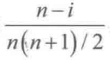

1．线性表有两种存储结构：一是顺序表，二是链表。试问：  
（1）如果有n个线性表同时并存，并且在处理过程中各表的长度会动态变化，线性表的总数也会自动地改变。在此情况下，应选用哪种存储结构？为什么？ 
> 个人回答：  
>   应该使用链表，因为顺序表需要声明长度，对于长度变化较敏感，容易造成溢出等异常  
>   而链表则不需要，链表可以动态的增加和删除结点，所以链表更适合这种场景。
>   
> 解析回答：  
>   链式存储结构可动态申请内存空间，只要内存空间允许，链表中的元素个数就没有限制；  
>   <i>此外这种存储结构对元素进行插入和删除操作时都无须移动元素，而仅仅修改指针即可，所以很适用于线性表容量变化的情况</i>

（2）若线性表的元素总数基本稳定，且很少进行插入和删除，但要求以最快的速度存取线性表中的元素，那么应采用哪种存储结构？为什么？ 
> 个人回答：  
>   应该使用顺序表，顺序表采取数组存储，可以以O(1)的时间复杂度访问任意元素
>
> 解析回答：  
>   选用顺序存储结构。  
>   顺序表是由数组实现的，它是一种随机存取结构，指定任意一个位置序号i，都可以在O(1)时间内直接存取该位置上的元素，即存取速度较高；  
>   另外由于题目中描述的线性表的元素总数基本确定，且很少进行插入和删除，故这一特点恰好避开了顺序存储结构的缺点。  
>   因此，应选用顺序存储结构

2．在单链表和双向链表中，能否从当前结点出发访问到任一结点？  
3．说明在线性表的链式存储结构中，头指针与头结点之间的根本区别，头结点与首元结点的关系。  
4．线性表(a1,a2,…,an)，采用顺序存储结构。试问：  
（1）在等概率的前提下，平均每插入一个元素需要移动的元素个数为多少？  
（2）若元素插在ai与ai+1之间（0≤i≤n-1）的概率为
，  
则平均每插入一个元素所要移动的元素个数又是多少？  

5．线性表(a1,a2,…,an)用顺序映射表示时，ai与ai+1（1≤i<n）的物理位置相邻吗？链表表示时呢？  