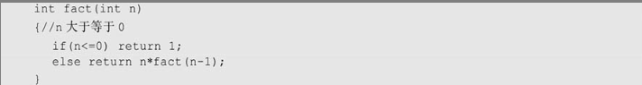
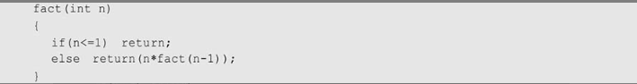
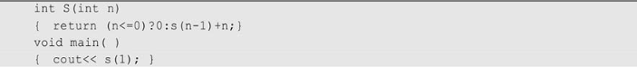
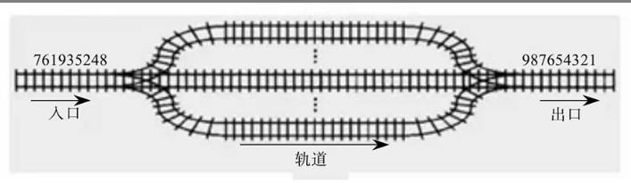
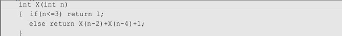

1．若让元素1，2，3，4，5依次进栈，则出栈次序不可能出现在( C )种情况。  
&emsp;A．5，4，3，2，1  
&emsp;B．2，1，5，4，3  
&emsp;C．4，3，1，2，5  
&emsp;D．2，3，5，4，1  
2．若已知一个栈的入栈序列是1，2，3，…，n，其输出序列为p1，p2，p3，…，pn，若p1=n，则pi为( C )。  
&emsp;A．i  
&emsp;B．n-i  
&emsp;C．n-i+1  
&emsp;D．不确定  
3．数组Q[n]用来表示一个循环队列，f为当前队列头元素的前一位置，r为队尾元素的位置，假定队列中元素的个数小于n，计算队列中元素个数的公式为( D )。  
> 对于非循环队列，尾指针和头指针的差值便是队列的长度，  
> 而对于循环队列，差值可能为负数，所以需要将差值加上n，然后与n求余

&emsp;A．r-f  
&emsp;B．(n+f-r)%n  
&emsp;C．n+r-f  
&emsp;D．（n+r-f）%n  
4．链式栈结点为（data，link），top指向栈顶，若想删除栈顶结点，并将删除结点的值保存到x中，则应执行操作( A )。  
&emsp;A．x=top->data;top=top->link；  
&emsp;B．top=top->link;x=top->link；  
&emsp;C．x=top;top=top->link；  
&emsp;D．x=top->link；  
5．设有一个递归算法如下：则计算fact(n)需要调用该函数的次数为( A )。  
> 递归调用一次n减1，从n开始，直到n等于0

&emsp;A．n+1  
&emsp;B．n-1  
&emsp;C．n  
&emsp;D．n+2  
6．栈在( D )中有所应用。  
&emsp;A．递归调用  
&emsp;B．函数调用  
&emsp;C．表达式求值  
&emsp;D．前三个选项都有  
7.【2009年第1题】为解决计算机主机与打印机间速度不匹配问题，通常设一个打印数据缓冲区。主机将要输出的数据依次写入该缓冲区，而打印机则依次从该缓冲区中取出数据。该缓冲区的逻辑结构应该是( A )。  
&emsp;A．队列  
&emsp;B．栈  
&emsp;C．线性表  
&emsp;D．有序表  
8．设栈S和队列Q的初始状态为空，元素e1，e2，e3，e4，e5和e6依次进入栈S，一个元素出栈后即进入Q，若6个元素出队的序列是e2，e4，e3，e6，e5和e1，则栈S的容量至少应该是( B )。  
&emsp;A．2  
&emsp;B．3  
&emsp;C．4  
&emsp;D．6  
9．若一个栈以向量V[1，…，n]存储，初始栈顶指针top设为n+1，则元素x进栈的正确操作是( C )。  错误选择B   
> 栈顶指针初始化位置为n+1，说明元素从数组向量的高端地址进栈，而向量V是[1, .. , n]存储，说明此时top在数组外  
> 因此插入元素时，先减掉top，然后再插入到top指定位置

&emsp;A．top++; V[top]=x;  
&emsp;B．V[top]=x; top++;  
&emsp;C．top--; V[top]=x;  
&emsp;D．V[top]=x; top--;  
10．设计一个判别表达式中左、右括号是否配对出现的算法，采用( D )数据结构最佳。  
&emsp;A．线性表的顺序存储结构  
&emsp;B．队列  
&emsp;C．线性表的链式存储结构  
&emsp;D．栈  
11．用链接方式存储的队列，在进行删除运算时( D )。  
&emsp;A．仅修改头指针  
&emsp;B．仅修改尾指针  
&emsp;C．头、尾指针都要修改  
&emsp;D．头、尾指针可能都要修改  
12．循环队列存储在数组A[0，…，m]中，则入队时的操作为( D )。  
&emsp;A．rear=rear+1  
&emsp;B．rear=(rear+1)%(m-1)  
&emsp;C．rear=(rear+1)%m  
&emsp;D．rear=(rear+1)%(m+1)  
13．最大容量为n的循环队列，队尾指针是rear，队头是front，则队空的条件是( B )。  
> 循环队列在实现时，为了区别队空还是队满，通常采用少用一个元素空间的方案  
> 这样判断为空的条件不变，仍然是 rear == front  
> 队满的条件为 (rear+1) % n == front

&emsp;A．(rear+1)%n==front  
&emsp;B．rear==front  
&emsp;C．rear+1==front  
&emsp;D．(rear-l)%n==front  
14．栈和队列的共同点是( C )。  
&emsp;A．都是先进先出  
&emsp;B．都是先进后出  
&emsp;C．只允许在端点处插入和删除元素  
&emsp;D．没有共同点  
15．一个递归算法必须包括( B )。  
&emsp;A．递归部分  
&emsp;B．终止条件和递归部分  
&emsp;C．迭代部分  
&emsp;D．终止条件和迭代部分  
16.【2009年第2题】设栈S和队列Q的初始状态均为空，元素a，b，c，d，e，f，g依次进入栈S。若每个元素出栈后立即进入队列Q，且7个元素出队的顺序是b，d，c，f，e，a，g，则栈S的容量至少是( C )。  
&emsp;A．1  
&emsp;B．2  
&emsp;C．3  
&emsp;D．4  
17.【2010年第1题】若元素a，b，c，d，e，f依次进栈，允许进栈、退栈操作交替进行，但不允许连续三次进行退栈工作，则不可能得到的出栈序列是( D )。 错误选择C  
> 题目要求不允许连续三次进行出栈操作，因此选项所给序列中出现长度大于等于3的连续逆序子序列，即为不符合要求的出栈序列

&emsp;A．d，c，e，b，f，a  
&emsp;B．c，b，d，a，e，f  
&emsp;C．b，c，a，e，f，d  
&emsp;D．a，f，e，d，c，b  
18.【2010年第2题】某队列允许在其两端进行入队操作，但仅允许在一端进行出队操作，若元素a，b，c，d，e依次入此队列后再进行出队操作，则不可能得到的出队序列是( C )。  
> 队列作为先进先出的数据结构，无论从哪边入队，对于最先入队的a, b，出队时a和b应该相邻

&emsp;A．b，a，c，d，e  
&emsp;B．d，b，a，c，e  
&emsp;C．d，b，c，a，e  
&emsp;D．e，c，b，a，d  
19.【2011年第2题】元素a，b，c，d，e依次进入初始为空的栈中，若元素进栈后可停留、可出栈，直到所有元素都出栈，则在所有可能的出栈序列中，以元素d开头的序列个数是( B )。  
> 出栈顺序必为d_c_b_a_，e的顺序不定，在任意一个“_”上都有可能

&emsp;A．3  
&emsp;B．4  
&emsp;C．5  
&emsp;D．6  
20.【2011年第3题】已知循环队列存储在一维数组A[0...n-1]中，且队列非空时front和rear分别指向队头元素和队尾元素。若初始时队列为空，且要求第1个进入队列的元素存储在A[0]处，则初始时front和rear的值分别是( B )。 错误选择D   
> 队列从队尾插入元素，插入元素会改变rear的值，而不会改变front的值  
> 若已知插入第一个元素后，元素位置为A[0]，则rear为 n - 1
> 而front应该指向第一个结点，所以front的值应该为 0

&emsp;A．0，0  
&emsp;B．0，n-1  
&emsp;C．n-1，0  
&emsp;D．n-1，n-1  
21.【2012年第1题】求整数n(n≥0)阶乘的算法如下，其时间复杂度是( B )。  

&emsp;A．O(log2n)  
&emsp;B．O(n)  
&emsp;C．O(nlog2n)  
&emsp;D．O(n2)  
22.【2012年第2题】操作符包括‘+’，‘-’，‘ * ’，‘/’和‘（’，‘）’。将中缀表达式a+b-a*((c+d)/e-f)+g转换为等价的后缀表达式ab+acd+e/f- * -g+时，用栈来存放暂时还不能确定运算次序的操作符，若栈初始时为空，则转换过程中同时保存在栈中的操作符的最大个数是( A )。  
&emsp;A．5  
&emsp;B．7  
&emsp;C．8  
&emsp;D．11  
23.【2013年第2题】一个栈的入栈序列为1，2，3，…，n，其出栈序列是p1，p2，p3，…，pn。若p2=3，则p3可能取值的个数是( C )。  错误选择B  
> 当p2为3，p3大于3的值，可能有n - 3种  
> 当考虑先入栈的1,2 时，p3可能为1，也可能为2  
> 因此为n-1种

&emsp;A．n-3  
&emsp;B．n-2  
&emsp;C．n-1  
&emsp;D．无法确定  
24.【2014年第2题】假设栈初始为空，将中缀表达式a/b+(c * d-e * f)/g转换为等价的后缀表达式的过程中，当扫描到f时，栈中的元素依次是( B )。  
&emsp;A．+( * -  
&emsp;B．+(- *   
&emsp;C．/+( * - *   
&emsp;D．/+-*  
25.【2014年第3题】循环队列放在一维数组A[0…M-1]中，end1指向队头元素，end2指向队尾元素的后一个位置。假设队列两端均可进行入队和出队操作，队列中最多能容纳M-1个元素。初始时为空。下列判断队空和队满的条件中，正确的是( A )。  错误选择C  
&emsp;A．队空：end1==end2；队满：end1==(end2+1)mod M  
&emsp;B．队空：end1==end2；队满：end2==(end1+1)mod (M-1)  
&emsp;C．队空：end2==(end1+1)mod M；队满：end1==(end2+1)mod M  
&emsp;D．队空：end1==(end2+1)mod M；队满：end2==(end1+1)mod (M-1)  
26.【2015年第1题】已知程序如下：程序运行时使用栈来保存调用过程的信息，自栈底到栈顶保存的信息一次对应的是( A )。  
&emsp;A．main( )->S(1)->S(0)  
&emsp;B．S(0)->S(1)->main( )  
&emsp;C．main( )->S(0)->S(1)  
&emsp;D．S(1)->S(0)->main( )  
27.【2016年第3题】设有如图3.1所示的火车车轨，入口到出口之间有n条轨道，列车的行进方向均从左至右，列车可驶入任意一条轨道，现有编号为1~9的9列列车，驶入的次序依次是8，4，2，5，3，9，1，6，7。若期望驶出的次序依次为1~9，则n至少是( C )。  

&emsp;A．2  
&emsp;B．3  
&emsp;C．4  
&emsp;D．5  
28．若一个栈的输入序列为1，2，3，…，n，输出序列的第一个元素是i，则第j个输出元素是( D )。  
&emsp;A．i-j-1  
&emsp;B．i-j  
&emsp;C．j-i+1  
&emsp;D．不确定的  
29．若用一个大小为6的数组来实现循环队列，且当前rear和front的值分别为0和3，当从队列中删除一个元素，再插入两个元素后，rear和front的值分别为( B )。  
&emsp;A．1和5  
&emsp;B．2和4  
&emsp;C．4和2  
&emsp;D．5和1  
30．设有一个递归算法如下：则计算X(X(8))时需要计算X函数( D )次  错误选择C  
> 函数本身调用X(8)/X(9)也算一次函数调用，所以是18次

&emsp;A．8  
&emsp;B．9  
&emsp;C．16  
&emsp;D．18