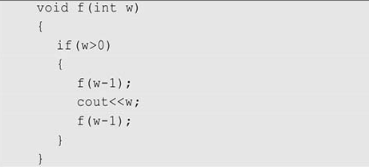
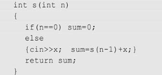

1. 有5个元素，其入栈次序为：A，B，C，D，E，在各种可能的出栈次序中，以元素C、D最先出栈（即C第一个且D第二个出栈）的次序有哪几个？
> C D 先出栈，说明此时A B仍在栈中，因此对于E来说，可能的位置在_处
> C D _ B _ A _
> 所以总共有3种情况

2. 对下面的递归函数，写出调用f(3)的运行结果

> 输出结果为 1 2 1 3 1 2 1  
> f(3)  
>   - f(2)  
>       - f(1)  
>           - f(0)  
>           - 1  
>           - f(0)  
>       - 2  
>       - f(1)  
>           - f(0)  
>           - 1  
>           - f(0)  
>   - 3  
>   - f(2)  
>       - f(1)  
>           - f(0)  
>           - 1  
>           - f(0)  
>       - 2  
>       - f(1)  
>           - f(0)  
>           - 1  
>           - f(0)  

3. 有递归函数如下：  
  
设初值n=4，读入x=4，9，6，2。问：  
（1）若x为局部变量时，该函数递归结束后返回调用程序时sum的值为多少？并画出在递归过程中栈状态的变化过程；  
（2）若x为全局变量时，该函数递归结束后返回调用程序时sum的值为多少？  
> (1) 若x为局部变量，则每次递归，x的值都在对应的递归层次中生效，也即每层递归中x都有独立的值
> - s(4) 4
>   - s(3) 9
>      - s(2) 6
>        - s(1) 2
>           - s(0) return 0
>        - return 0 + 2
>      - return 0 + 2 + 6
>   - return 0 + 2 + 6 + 9  
> - return 0 + 2 + 6 + 9 + 4  = 21

> (2)若x为全局变量，说明该变量只有一个存储单元，且与递归栈中无关，只会保留最后一次输入的值，也即，可以理解为每次递归入栈时，不会给x留出空间  
> - s(4) 4
>   - s(3) 9
>      - s(2) 6
>        - s(1) 2
>           - s(0) return 0
>        - return 0 + 2
>      - return 0 + 2 + 2
>   - return 0 + 2 + 2 + 2
> - return 0 + 2 + 2 + 2 + 2  = 8

4. 对中缀算法表达式，可以借助运算符栈OPTR和运算数栈OPND进行求值，按照四则运算加、减、乘、除优先关系的惯例，以表格形式完成表达式3*(6-5)的求值过程，给出OPTR栈和OPND栈的具体变化过程
> 中缀表达式 3*(6-5)

| **OPTR**  | **OPND** | **MID EXPR** |
|:---------:|:--------:|:------------:|
|  #        |          | 3\*\(6\-5\)# |
|     #     | 3        |   \*(6-5)#   |
|    #\*    | 3        |  \(6\-5\)#   |
|  #\* \(   | 3        |   6\-5\)#    |
|  #\* \(   | 3 6      |    \-5\)#    |
| #\* \( \- | 3 6      |     5\)#     |
| #\* \( \- | 3 6 5    |     \)#      |
|  #\* \(   | 3 1      |     \)#      |
|    #\*    | 3 1      |      #       |
|     #     | 3        |      #       |

5. 用栈实现将中缀表达式8-(3+5)*(5-6/2)转换成后缀表达式，画出栈的变化过程图
> 计算过程
| OPTR   | OPND  | MID EXPR         |
|--------|-------|------------------|
| #      |       | 8-(3+5)*(5-6/2)# |
| #      | 8     | -(3+5)*(5-6/2)#  |
| #-     | 8     | (3+5)*(5-6/2)#   |
| #-(    | 8     | 3+5)*(5-6/2)#    |
| #-(    | 83    | +5)*(5-6/2)#     |
| #-(+   | 83    | 5)*(5-6/2)#      |
| #-(+   | 835   | )*(5-6/2)#       |
| #-(    | 88    | )*(5-6/2)#       |
| #-     | 88    | *(5-6/2)#        |
| #-*    | 88    | (5-6/2)#         |
| #-*(   | 88    | 5-6/2)#          |
| #-*(   | 885   | -6/2)#           |
| #-*(-  | 885   | 6/2)#            |
| #-*(-  | 8856  | /2)#             |
| #-*(-/ | 8856  | 2)#              |
| #-*(-/ | 88562 | )#               |
| #-*(-  | 8853  | )#               |
| #-*(   | 882   | )#               |
| #-*    | 882   | #                |
| #-     | 16    | #                |
| #      | -5    | #                |

> 转换过程

| OPTR   | SUFFIX EXPR | MID EXPR         |
|--------|-------------|------------------|
| #      |             | 8-(3+5)*(5-6/2)# |
| #      | 8           | -(3+5)*(5-6/2)#  |
| #-     | 8           | (3+5)*(5-6/2)#   |
| #-(    | 8           | 3+5)*(5-6/2)#    |
| #-(    | 83          | +5)*(5-6/2)#     |
| #-(+   | 83          | 5)*(5-6/2)#      |
| #-(+   | 835         | )*(5-6/2)#       |
| #-(    | 835+        | )*(5-6/2)#       |
| #-     | 835+        | *(5-6/2)#        |
| #-*    | 835+        | (5-6/2)#         |
| #-*(   | 835+        | 5-6/2)#          |
| #-*(   | 835+5       | -6/2)#           |
| #-*(-  | 835+5       | 6/2)#            |
| #-*(-  | 835+56      | /2)#             |
| #-*(-/ | 835+56      | 2)#              |
| #-*(-/ | 835+562     | )#               |
| #-*(-  | 835+562/    | )#               |
| #-*(   | 835+562/-   | )#               |
| #-*    | 835+562/-   | #                |
| #-     | 835+562/-*  | #                |
| #      | 835+562/-*- | #                |
