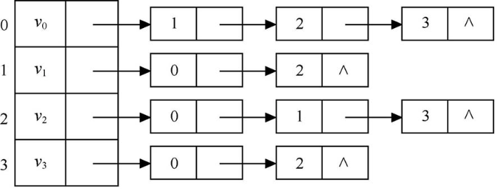

1．在一个图中，所有顶点的度数之和等于图的边数的( C )倍。  
&emsp;A．1/2  
&emsp;B．1  
&emsp;C．2  
&emsp;D．4  
2．在一个有向图中，所有顶点的入度之和等于所有顶点的出度之和的( B )倍。  
&emsp;A．1/2  
&emsp;B．1  
&emsp;C．2  
&emsp;D．4  
3．具有n个顶点的有向图最多有( B )条边。  
> 完全有向图

&emsp;A．n  
&emsp;B．n(n-1)  
&emsp;C．n(n+1)  
&emsp;D．n2  
4.n个顶点的连通图用邻接矩阵表示时，该矩阵至少有( B )个非零元素。  
> 连通图一般指代无向图，强连通图一般指代有向图  
> 如果对于图中任意两个顶点vi、vj∈V，vi和vj都是连通的，则称G是连通图  
> 所以至少有n-1条边  
> 又因为是无向图  
> 所以是2(n-1)  

&emsp;A．n  
&emsp;B．2(n-1)  
&emsp;C．n/2  
&emsp;D．n2  
5.G是一个非连通无向图，共有28条边，则该图至少有( C )个顶点。  
> 题目问的是至少，则假设G是一个完全无向图，则根据边数与顶点数的关系公式 edge_num = n(n-1)/2  
> 则G有8个点  
> 又因为G本身是非联通的，所以至少9个点  
> 因为如果点数小于等于8，此时28的总边数已经最大了  

&emsp;A．7  
&emsp;B．8  
&emsp;C．9  
&emsp;D．10  
6．若从无向图的任意一个顶点出发进行一次深度优先搜索可以访问图中所有的顶点，则该图一定是( B )图。  
&emsp;A．非连通  
&emsp;B．连通  
&emsp;C．强连通  
&emsp;D．有向  
7．下面( A )适合构造一个稠密图G的最小生成树。  
> Kruskal算法和边数有关

&emsp;A．Prim算法  
&emsp;B．Kruskal算法  
&emsp;C．Floyd算法  
&emsp;D．Dijkstra算法  
8．用邻接表表示图进行广度优先遍历时，通常借助( B )来实现算法。  
&emsp;A．栈  
&emsp;B．队列  
&emsp;C．树  
&emsp;D．图  
9．用邻接表表示图进行深度优先遍历时，通常借助( A )来实现算法。  
&emsp;A．栈  
&emsp;B．队列  
&emsp;C．树  
&emsp;D．图  
10．深度优先遍历类似于二叉树的( A )。  错误选择B  
&emsp;A．先序遍历  
&emsp;B．中序遍历  
&emsp;C．后序遍历  
&emsp;D．层次遍历  
11．广度优先遍历类似于二叉树的( D )。  
&emsp;A．先序遍历  
&emsp;B．中序遍历  
&emsp;C．后序遍历  
&emsp;D．层次遍历  
12．图的BFS生成树的树高比DFS生成树的树高( C )。  
> 对于一些特殊的图，比如只有一个顶点的图，其BFS生成树的树高和DFS生成树的树高相等  
> 而对于一般的图，根据图的BFS生成树和DFS生成树的构造过程，BFS生成树的树高比DFS生成树的树高小  

&emsp;A．小  
&emsp;B．相等  
&emsp;C．小或相等  
&emsp;D．大或相等  
13．已知图的邻接矩阵如图6.1所示，则从顶点v0出发按深度优先遍历的结果是( C )。  
&emsp;  
&emsp;A．0243156  
&emsp;B．0136542  
&emsp;C．0134256  
&emsp;D．0361542  
14．已知图的邻接表如图6.2所示，则从顶点v0出发  
&emsp;&emsp;按广度优先遍历的结果是( D )，  
&emsp;&emsp;按深度优先遍历的结果是( D )。  
&emsp;  
&emsp;A．0 1 3 2  
&emsp;B．0 2 3 1  
&emsp;C．0 3 2 1  
&emsp;D．0 1 2 3   
15．下面( B )方法可以判断出一个有向图是否有环。  
&emsp;A．广度优先遍历  
&emsp;B．拓扑排序  
&emsp;C．求最短路径  
&emsp;D．求关键路径  
16.【2009年第7题】下列关于无向连通图特性的叙述中，正确的是( A )。  错误选择D  
> 如果图中只包含一个连接所有顶点的环，图的边数等于顶点个数，每个顶点的度就都是2  

&emsp;&emsp;I.所有顶点的度之和为偶数。  
&emsp;&emsp;II.边数大于顶点个数减1。  
&emsp;&emsp;III.至少有一个顶点的度为1。  
&emsp;A．只有I  
&emsp;B．只有II  
&emsp;C．I和II  
&emsp;D．I和III  
17.【2010年第7题】若无向图G=(V,E)中含7个顶点，要保证图G在任何情况下都是连通的，则需要的边数最少是( C )。  
&emsp;A．6  
&emsp;B．15  
&emsp;C．16  
&emsp;D．21  
18.【2010年第8题】对图6.3所示的有向图进行拓扑排序，可以得到不同的拓扑序列的个数是( B )。  错误选择A  
&emsp;  
&emsp;A．4  
&emsp;B．3  
&emsp;C．2  
&emsp;D．1   
19.【2011年第8题】下列关于图的叙述中，正确的是( C )。  
&emsp;&emsp;Ⅰ.回路是简单路径。  
&emsp;&emsp;Ⅱ.存储稀疏图，用邻接矩阵比邻接表更省空间。  
&emsp;&emsp;Ⅲ.若有向图中存在拓扑序列，则该图不存在回路。  
&emsp;A．仅Ⅱ  
&emsp;B．仅Ⅰ、Ⅱ  
&emsp;C．仅Ⅲ  
&emsp;D．仅Ⅰ、Ⅲ  
20.【2012年第5题】对于有n个顶点、e条边且使用邻接表存储的有向图进行广度优先遍历，其算法的时间复杂度是( C )。  
&emsp;A．O(n)  
&emsp;B．O(e)  
&emsp;C．O(n+e)  
&emsp;D．O(n×e)  
21.【2012年第6题】若用邻接矩阵存储有向图，矩阵中主对角线以下的元素均为零，则关于该图拓扑序列的结论是( C )。  
&emsp;A．存在，且唯一  
&emsp;B．存在，且不唯一  
&emsp;C．存在，可能不唯一  
&emsp;D．无法确定是否存在  
22.【2012年第7题】对图6.4的有向带权图，若采用迪杰斯特拉（Dijkstra）算法求源点a到其他各顶点的最短路径，则得到的第一条最短路径的目标顶点是b，第二条最短路径的目标顶点是c，后序得到的其余各最短路径的目标顶点依次是( C )。  
&emsp;  
&emsp;A．d，e，f  
&emsp;B．e，d，f  
&emsp;C．f，d，e  
&emsp;D．f，e，d   
23.【2012年第8题】下列关于最小生成树的说法中，正确的是( A )。  错误选择B  
&emsp;   I.最小生成树的代价唯一。  
&emsp;  II.权值最小的边一定会出现在所有的最小生成树中。  
&emsp;  III.用普里姆（Prim）算法从不同顶点开始得到的最小生成树一定相同。  
&emsp;  IV.使用普里姆和克鲁斯卡尔（Kruskal）算法得到的最小生成树总不相同。  
&emsp;A．仅I  
&emsp;B．仅II  
&emsp;C．仅I、III  
&emsp;D．仅II、IV  
24.【2013年第7题】设图的邻接矩阵A如图6.5所示。各顶点的度依次是( C )。  
&emsp;  
&emsp;A．1，2，1，2  
&emsp;B．2，2，1，1  
&emsp;C．3，4，2，3  
&emsp;D．4，4，2，2  
25.【2013年第8题】若对图6.6所示的无向图进行遍历，则下列选项中，不是广度优先遍历序列的是( D )。  
&emsp;  
&emsp;A．h，c，a，b，d，e，g，f  
&emsp;B．e，a，f，g，b，h，c，d  
&emsp;C．d，b，c，a，h，e，f，g  
&emsp;D．a，b，c，d，h，e，f，g  
26.【2013年第9题】图6.7所示的AOE网表示一项包含8个活动的工程。通过同时加快若干活动的进度可以缩短整个工程的工期。下列选项中，加快其进度就可以缩短工程工期的是( C )。 错误选择A  
&emsp;  
&emsp;A．c和e  
&emsp;B．d和e  
&emsp;C．f和d  
&emsp;D．f和h  
27.【2014年第7题】对如图6.8所示的有向图进行拓扑排序，得到的拓扑序列可能是( D )。  
&emsp;  
&emsp;A．3，1，2，4，5，6  
&emsp;B．3，1，2，4，6，5  
&emsp;C．3，1，4，2，5，6  
&emsp;D．3，1，4，2，6，5  
28.【2015年第5题】设有向图G=(V,E)，顶点集V={V0,V1,V2,V3}E={<V0,V1>,<V0,V2>,<V0,V3>,<V1,V3>}，若从顶点V0开始对图进行深度优先遍历，则可能得到的不同遍历序列个数是( D )。  
&emsp;A．2  
&emsp;B．3  
&emsp;C．4  
&emsp;D．5  
29.【2015年第6题】求图6.9所示带权图的最小（代价）生成树时，可能是克鲁斯卡（Kruskal）算法第二次选中但不是普里姆（Prim）算法（从V4开始）第2次选中的边是( C )。  
&emsp;  
&emsp;A．(V1,V3)  
&emsp;B．(V1,V4)  
&emsp;C．(V2,V3)  
&emsp;D．(V3,V4)  
30.【2016年第6题】下列选项中，不是如图6.10所示图的深度优先搜索序列的是( D )。  
&emsp;  
&emsp;A．v1，v5，v4，v3，v2  
&emsp;B．v1，v3，v2，v5，v4  
&emsp;C．v1，v2，v5，v4，v3  
&emsp;D．v1，v2，v3，v4，v5  
31.【2016年第7题】对于有n个顶点e条边的有向图采用邻接表存储，则拓扑排序算法的时间复杂度是( B )。  
&emsp;A．O(n)  
&emsp;B．O(n+e)  
&emsp;C．O(n2)  
&emsp;D．O(n×e)  
32.【2016年第7题】使用迪杰斯特拉（Dijkstra）算法求图6.11中从顶点1到其他各顶点的最短路径，依次得到的各最短路径的目标顶点是( B )。  
&emsp;  
&emsp;A．5，2，3，4，6  
&emsp;B．5，2，3，6，4  
&emsp;C．5，2，4，3，6  
&emsp;D．5，2，6，3，4